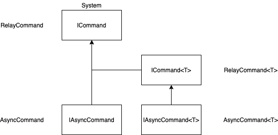

# XToolkit Common

The most common components without dependencies. Almost all projects ~~can~~ should use this library.

## Install

When you use this component separately from WhiteLabel.

You can install via NuGet: [](https://www.nuget.org/packages/Softeq.XToolkit.Common)

```text
Install-Package Softeq.XToolkit.Common
```

## Description

### Common

#### Collections

Class | Description
------|------------
[ObservableRangeCollection](xref:Softeq.XToolkit.Common.Collections.ObservableRangeCollection`1) | Represents a dynamic data collection that provides notifications when items get added, removed, or when the whole list is refreshed.
[ObservableItemContentRangeCollection](xref:Softeq.XToolkit.Common.Collections.ObservableItemContentRangeCollection`1) | Additionally to notifications inherited from ObservableRangeCollection notifies when any of the items (INotifyPropertyChanged) is updated.
[ObservableKeyGroupsCollection](xref:Softeq.XToolkit.Common.Collections.IObservableKeyGroupsCollection`2) | Grouping of items by key into ObservableRange.
[ObservableKeyGroupsCollectionNew](xref:Softeq.XToolkit.Common.Collections.ObservableKeyGroupsCollectionNew`2) | Represents groups of items that provides notifications when groups or it's items get added, removed, or when the whole list is refreshed.
[CollectionSorter](xref:Softeq.XToolkit.Common.Collections.CollectionSorter) | Order collection using Comparison.
[BiDictionary](xref:Softeq.XToolkit.Common.Collections.BiDictionary`2) | Use this dictionary in case you need fast access to the key by value.

#### Extensions

- **Assembly**
- **DateTime**
- **Dictionary**
- **Enumerable**
- **Enum**
- **List**
- **Stream**
- **String**
- **Task**
- **Type**

#### Helpers

- **StringsHelper**
- **TagsHelper**
- **TextRange**

#### WeakObjects

Class | Description
------|------------
[WeakAction](xref:Softeq.XToolkit.Common.Weak.WeakAction) | Stores an Action without causing a hard reference to be created to the Action's owner. The owner can be garbage collected at any time.
[WeakFunc](xref:Softeq.XToolkit.Common.Weak.WeakFunc`2) | Stores a Func without causing a hard reference to be created to the Func's owner. The owner can be garbage collected at any time.
[WeakEventSubscription](xref:Softeq.XToolkit.Common.Weak.WeakEventSubscription`1) | Weak subscription for any event.

#### Commands

Class | Description
------|------------
[RelayCommand](xref:Softeq.XToolkit.Common.Commands.RelayCommand) | Implementation of ICommand interface. Used WeakAction and WeakFunc.
[AsyncCommand](xref:Softeq.XToolkit.Common.Commands.AsyncCommand) | Implementation of ICommand interface. Allows Commands to safely be used asynchronously with Task.



#### Other

Class | Description
------|------------
[Timer](xref:Softeq.XToolkit.Common.Timers.Timer) | Cross-platform Async timer.
[TaskReference](xref:Softeq.XToolkit.Common.Tasks.TaskReference) | Use this class if you want to create a Task but don't want to start it immediately.
[GenericEventArgs](xref:Softeq.XToolkit.Common.GenericEventArgs`1) | Generic EventArgs class.

### Common.iOS

#### iOS Extensions

- **DateTime** - DateTime to NSDate and back converter
- **UIColor**
- **UIImage**
- **UITextField**
- **UIView**
- **UIViewController**

### Common.Droid

- **BoolToViewStateConverter**

#### Droid Extensions

- **Context**
- **EditText**
- **Intent**
- **String**
- **TextView**
- **View**

---
