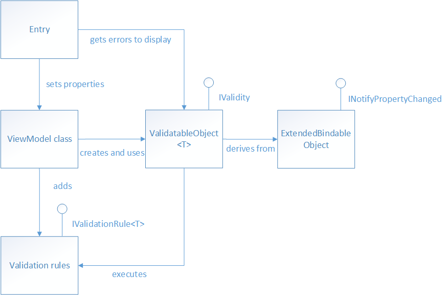

# Validation

In the context of the Model-ViewModel-Model (MVVM) pattern, a view model or model will often be required to perform data validation and signal any validation errors to the view so that the user can correct them.

The following diagram shows the classes involved in performing validation in the WhiteLabel:



View model properties that require validation are of type [ValidatableObject](xref:Softeq.XToolkit.WhiteLabel.Validation.ValidatableObject`1), and each [ValidatableObject](xref:Softeq.XToolkit.WhiteLabel.Validation.ValidatableObject`1) instance has validation rules added to its Validations property. Validation is invoked from the view model by calling the Validate method of the [ValidatableObject](xref:Softeq.XToolkit.WhiteLabel.Validation.ValidatableObject`1) instance, which retrieves the validation rules and executes them against the [ValidatableObject](xref:Softeq.XToolkit.WhiteLabel.Validation.ValidatableObject`1) `Value` property. Any validation errors are placed into the `Errors` property of the [ValidatableObject](xref:Softeq.XToolkit.WhiteLabel.Validation.ValidatableObject`1) instance, and the `IsValid` property of the [ValidatableObject](xref:Softeq.XToolkit.WhiteLabel.Validation.ValidatableObject`1) instance is updated to indicate whether validation succeeded or failed.

## Property

### Create property

```cs
public ValidatableObject<string> UserName { get; }

//...

UserName = new ValidatableObject<string>();
```

### Adding Validation Rules

```cs
var rule = new IsNotNullOrEmptyRule("A username is required.");

UserName.AddRule(rule);
```

This method adds the [IsNotNullOrEmptyRule](xref:Softeq.XToolkit.WhiteLabel.Validation.Rules.IsNotNullOrEmptyRule) validation rule to the [ValidatableObject](xref:Softeq.XToolkit.WhiteLabel.Validation.ValidatableObject`1) instance, including a value for the `ValidationMessage` property, which specifies the validation error message that will be displayed if validation fails.

#### Specifying Validation Rules

Validation rules are specified by creating a class that derives from the [IValidationRule](xref:Softeq.XToolkit.WhiteLabel.Validation.IValidationRule`1) interface.

### Triggering Validation

Validation can be triggered manually for a view model property.

```cs
private bool ValidateUserName()
{
    return UserName.Validate();
}
```

## Groups

Also, you can group several [ValidatableObject](xref:Softeq.XToolkit.WhiteLabel.Validation.ValidatableObject`1) instances to the [ValidatableGroup](xref:Softeq.XToolkit.WhiteLabel.Validation.ValidatableGroup):

```cs
var validatableGroup = new ValidatableGroup(UserName, Email);
```

Now you can validate all of these properties:

```cs
var isValid = validatableGroup.Validate();
```

## More info

This approach was reworked, based on MS:

- [Validation in Enterprise Apps](https://docs.microsoft.com/en-us/xamarin/xamarin-forms/enterprise-application-patterns/validation)

---
